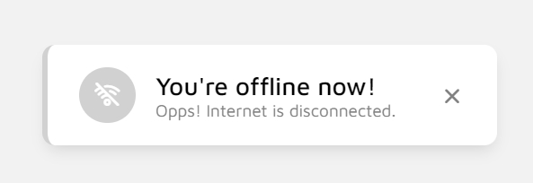

# Detect Internet Connection

Sometimes our internet is disconnect while on the website.\
Even, that's why some things don't work. But we can't to notice that when on the time.\
So, here we are!\
With this project, You will notice your connect situation with a toast notification.

This project includes XMLHttpRequest() things,  setInterval(), setTimeout() etc.

