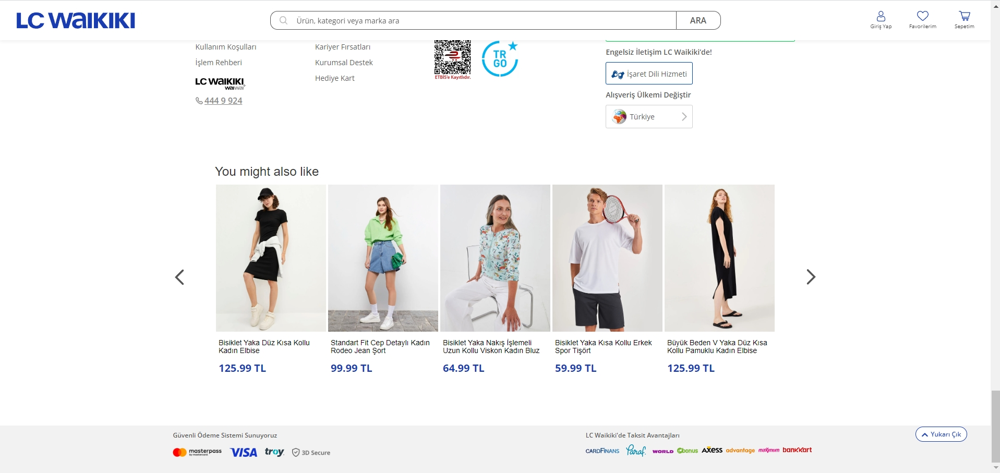

# Infinite Carousel to E-commerce Site

We always see recommend products in e-commerce sites.
These products show the backend data coming to frontend with **carousel structure**.

Thanks to this project, you can integrate the infinite carousel to every single e-commerce sites.
In this project, the target was web site of Lc Waikiki.
When you run js file in the console, component create perfectly after footer-content.

Project created with **Jquery**. Insider's task API was used for products. 

